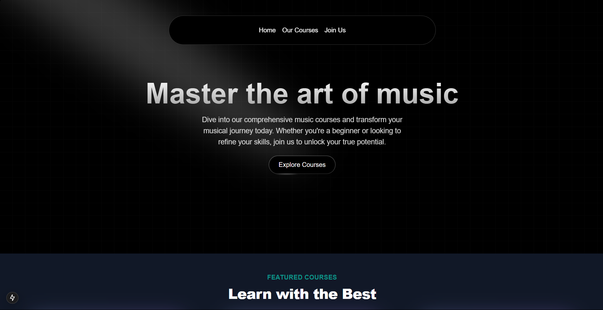
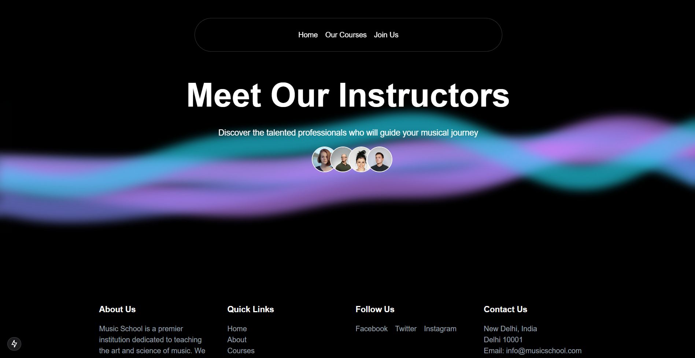
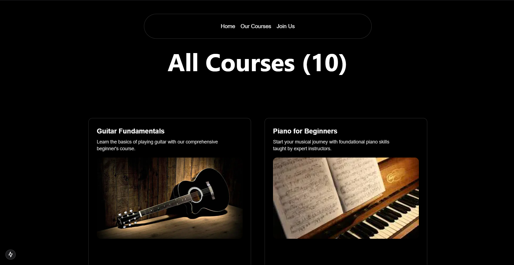
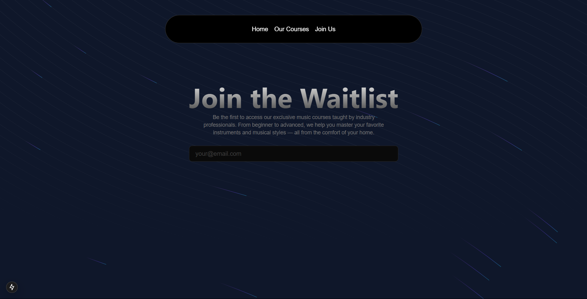

## 🚀 Live Demo

🔗 [https://musicverse-course.vercel.app](https://musicverse-course.vercel.app) 

# 🎵 MusicVerse – Premium Music Course Platform (Next.js)

🚀 **MusicVerse** is a beautifully designed, fully responsive platform for discovering and purchasing premium music courses online. Built with **Next.js** and styled using the elegant **Aceternity UI components**, the platform offers a smooth, modern, and immersive learning experience for music enthusiasts of all levels.


## ✨ Features

### 🔹 User Experience
- 🎹 **Browse Courses** – Explore a wide variety of music courses (instruments, vocals etc.).
- 💎 **Modern UI** – Crafted using **Aceternity UI** for an aesthetic and intuitive design.


## 🛠️ Tech Stack

- **Frontend:** Next.js (App Router)
- **UI Library:** [Aceternity UI](https://ui.aceternity.com)
- **Styling:** Tailwind CSS


---

## ⚙️ Getting Started (Local Setup)

1. Clone the Repository  
    ```sh
    git clone https://github.com/piyushpawar079/musicverse.git
    cd musicverse
    ```

2. Install required dependencies
    ```sh
    npm install
    ```

3. Start the server
    ```sh
    npm run dev
    ```

4. Open in Browser
- Visit http://localhost:3000 to view the website.

## ScreenShots

- 1. Home Page



- 2. Instructors Section



- 3. Courses Page



- 4. Join Us Page


